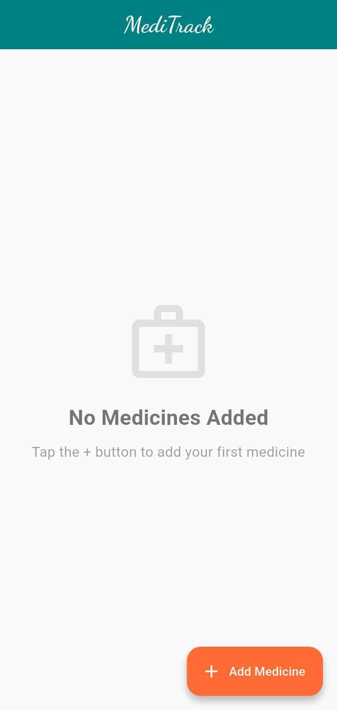
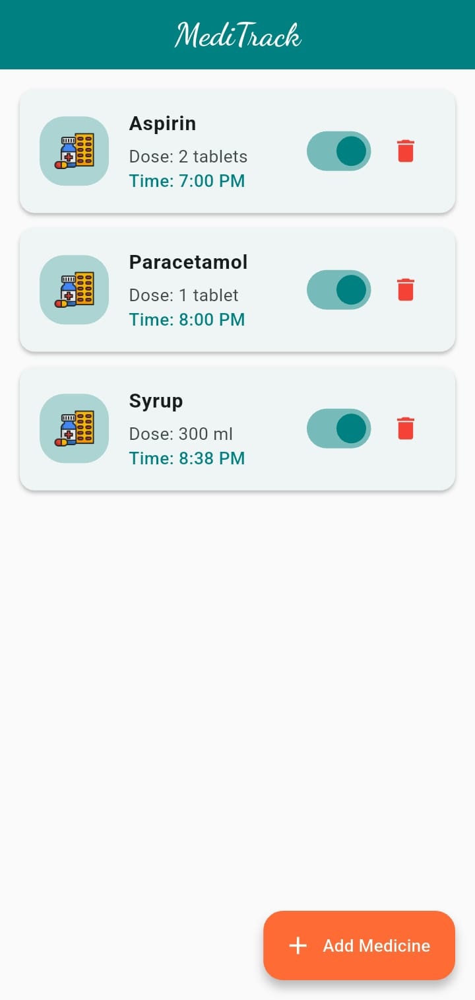
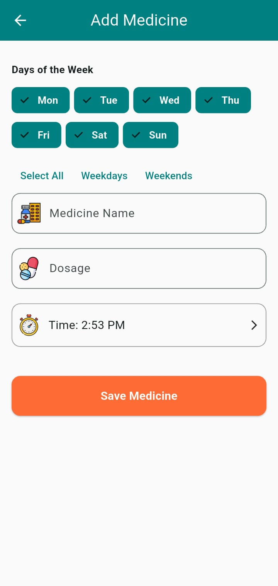

#

## Screenshots

### Home Screen


### Home Screen with Items


### Add Medicine Screen

# 

# MediTrack

MediTrack is a Flutter-based medicine reminder app that helps users manage their medication schedules efficiently. It provides notifications for scheduled medicines, allows users to add, edit, and delete medicines, and offers a clean, modern UI.

## Features
- Add, edit, and delete medicines
- Schedule medicine reminders with notifications
- Toggle medicine reminders on/off
- Modern, responsive UI

## Getting Started

### Prerequisites
- [Flutter SDK](https://flutter.dev/docs/get-started/install)
- Android Studio or VS Code

### Installation
1. Clone the repository:
	```sh
	git clone https://github.com/MahendraTamrakar/MediTrack.git
	```
2. Navigate to the project directory:
	```sh
	cd medicine_reminder_app
	```
3. Get dependencies:
	```sh
	flutter pub get
	```
4. Run the app:
	```sh
	flutter run
	```

### Building APK
To build the APK for Android:
```sh
flutter build apk
```
The APK will be generated in the `build/app/outputs/flutter-apk/` directory.

## Folder Structure
- `lib/` - Main application code
	- `app/` - App entry and routing
		- app.dart
		- routes.dart
	- `core/` - Theme and core utilities
	- `models/` - Data models
		- medicine_model.dart
		- medicine_model.g.dart
	- `screens/` - UI screens
		- add_medicine_screen.dart
		- alert_screen_ui.dart
		- home_screen.dart
		- `widgets/` - Reusable widgets
			- empty_state.dart
			- medicine_card.dart
	- `services/` - Notification and storage services
		- notification_service.dart
		- storage_service.dart
	- `utils/` - Constants and helpers
		- constants.dart
		- helper.dart
	- `viewmodels/` - State management
		- medicine_viewmodels.dart
- `android/` - Android-specific files
- `ios/` - iOS-specific files
- `assets/` - Images and other assets

## Contributing
Pull requests are welcome. For major changes, please open an issue first to discuss what you would like to change.

## License
This project is licensed under the MIT License.
